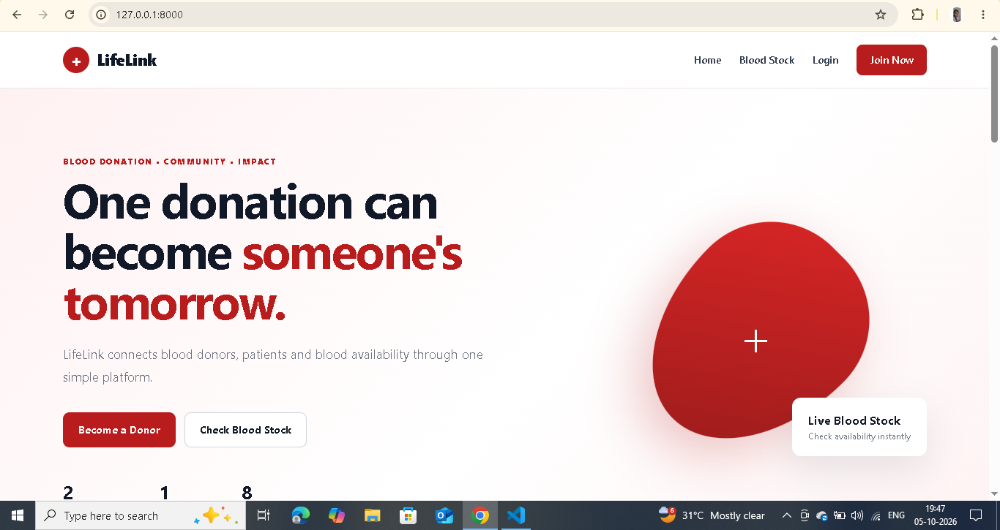
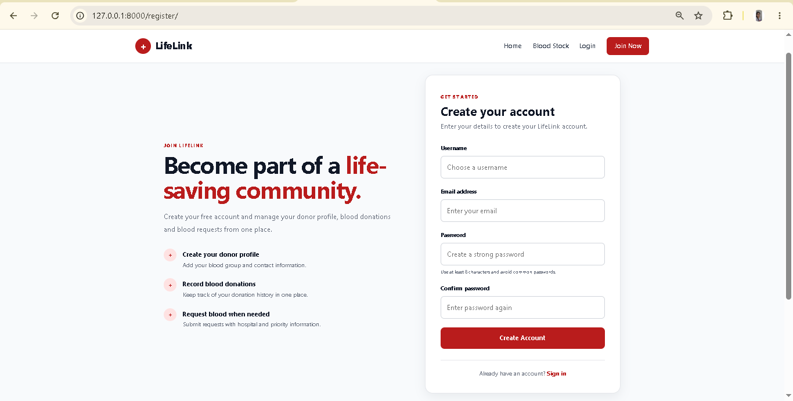
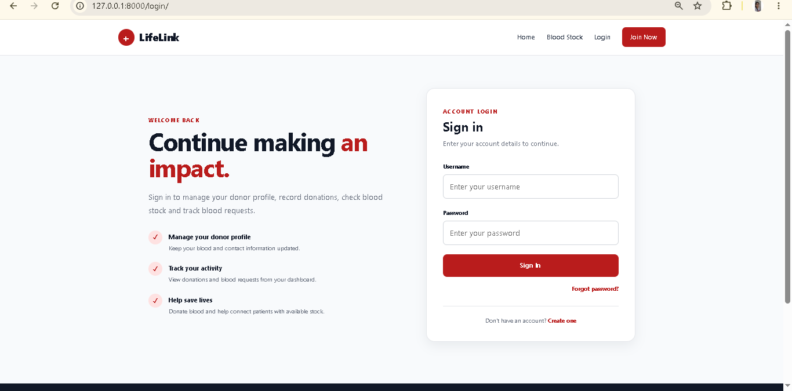
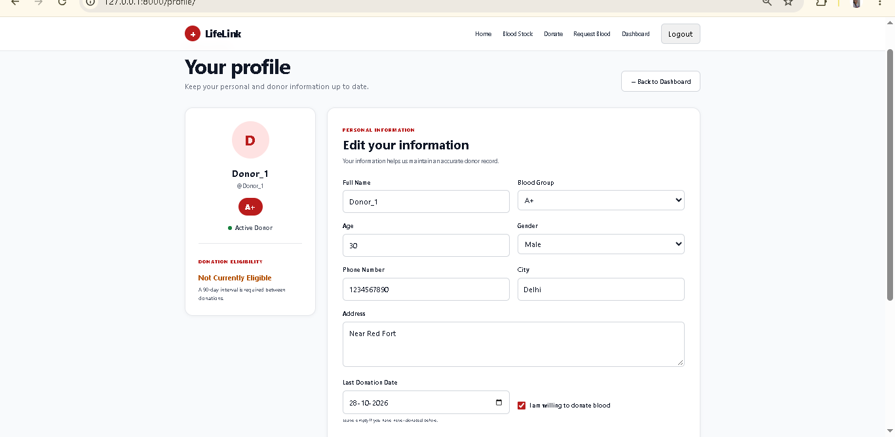
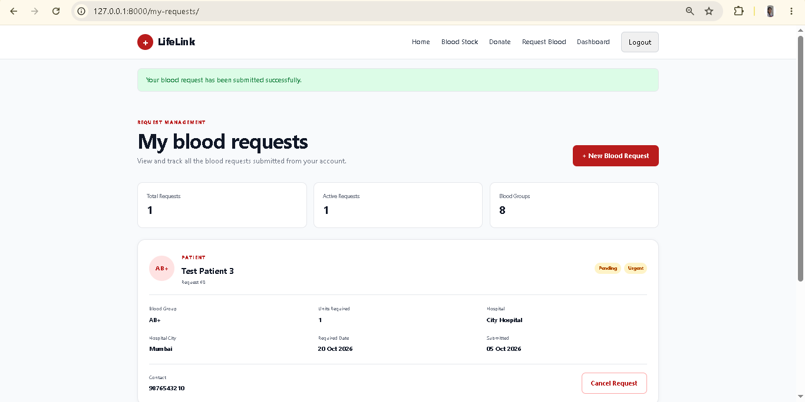
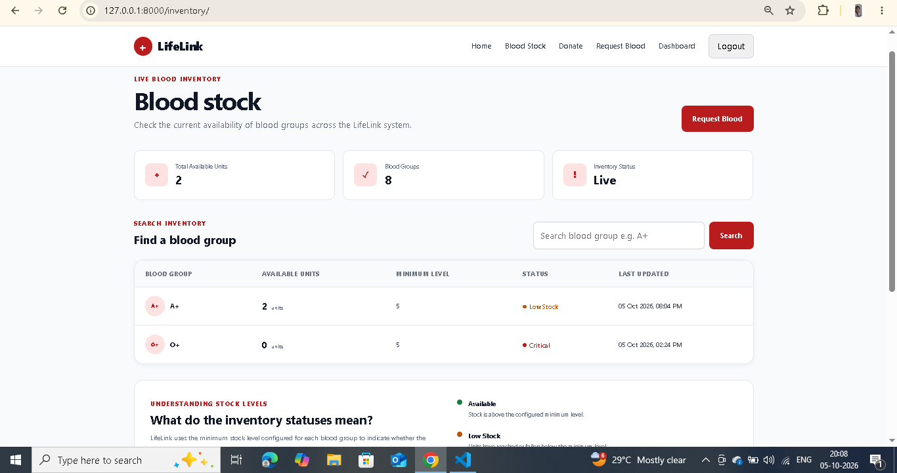
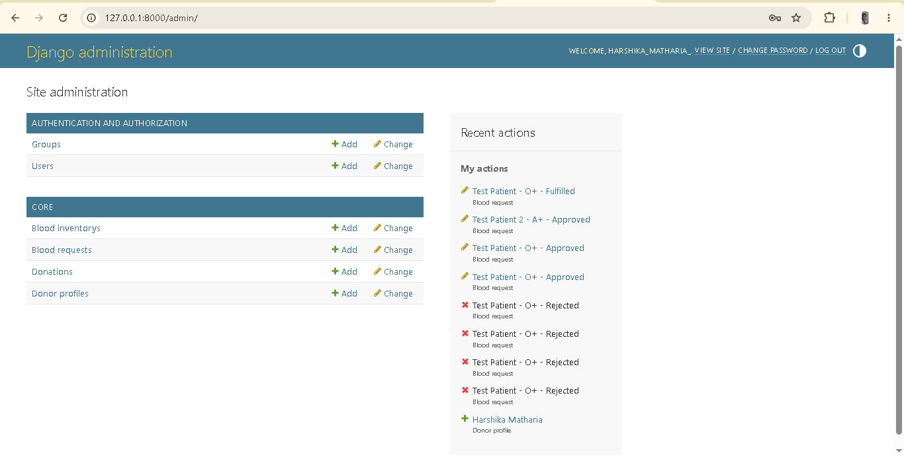

# LifeLink - Blood Bank Management System

A full-stack web application built with Django to manage blood donors, donations, blood inventory, and patient blood requests through a centralized and user-friendly platform.

LifeLink was developed as a practical software engineering project to demonstrate backend development, relational database design, authentication, business logic, form validation, CRUD operations, transaction handling, and Django's Model-View-Template architecture.

## Overview

Blood availability and donor management require accurate records and efficient coordination. LifeLink provides a digital platform where users can create donor profiles, record blood donations, view blood inventory, and submit blood requests.

The application also includes a Django administration panel for managing system data and monitoring donor, donation, inventory, and request records.

## Key Features

### Authentication & User Management

- User registration and login
- Secure password handling using Django authentication
- Logout functionality
- Password change functionality
- Password reset workflow
- Session-based authentication
- Protected pages using authentication decorators
- User-specific dashboards and records

### Donor Management

- Create and manage donor profiles
- Store donor name, blood group, age, gender, phone number, address, and city
- Maintain active donor status
- Track previous donation date
- Validate donor age
- Automatically determine donation eligibility
- Connect donor profiles with authenticated users

### Donation Eligibility

The application includes business logic to determine whether a donor is currently eligible to donate blood.

A donor is considered eligible when:

- The donor is registered as an active donor
- The donor has never donated before, or
- At least 90 days have passed since the previous donation

This rule is checked before recording a new donation.

### Blood Donation Management

- Record blood donations
- Select blood group and number of units
- Store donation date
- Add optional donation notes
- Associate donations with the logged-in donor
- Track donation status
- Automatically update blood inventory for completed donations
- Update the donor's last donation date

### Blood Inventory Management

- Maintain inventory for all supported blood groups
- Track available blood units
- Configure minimum stock levels
- Display inventory status
- Identify critical, low, and available stock
- Search inventory by blood group
- Automatically increase inventory after completed donations

### Blood Request Management

Users can submit requests when blood is required for a patient.

Each request can contain:

- Patient name
- Required blood group
- Required number of units
- Hospital name
- Hospital city
- Priority level
- Required date
- Contact phone number
- Reason for request
- Request status

Users can also view their submitted requests and cancel requests that are still pending.

### User Dashboard

The dashboard provides a personalized overview of the user's activity.

It includes:

- Donor profile information
- Recent donations
- Total donation count
- Recent blood requests
- Total request count
- Donation eligibility information
- Quick access to important application features

### Blood Inventory Search

Users can search the blood inventory by blood group to quickly check available stock.

### Django Admin Panel

The application includes a customized Django admin panel for managing:

- Donor profiles
- Blood inventory
- Donations
- Blood requests

Admin functionality includes:

- Search
- Filtering
- Organized list views
- Status monitoring
- Data management

## Technical Highlights

- Django Model-View-Template architecture
- Django ORM
- Relational database design
- One-to-one relationships
- One-to-many relationships
- ModelForms
- Server-side form validation
- Authentication and authorization
- Session management
- Transaction handling with `transaction.atomic()`
- Database aggregation using Django ORM
- Custom model properties for business logic
- Django messages framework
- CSRF protection
- Login-required protected views
- Customized Django admin
- Static file handling
- Git and GitHub version control

## Application Architecture

The application follows Django's Model-View-Template architecture.

    User / Browser
          |
          v
    URL Routing
          |
          v
        Views
       /     \
      v       v
    Forms    Models
      |        |
      |        v
      |    SQLite Database
      |        |
      +------> Views
                |
                v
            Templates
                |
                v
          User Interface

### Application Flow

A typical request follows this flow:

1. The user interacts with the web interface.
2. Django receives the HTTP request.
3. URL routing identifies the appropriate view.
4. The view processes the request.
5. Forms validate user input when required.
6. Django ORM communicates with the database.
7. Business logic is applied.
8. The view prepares the required context.
9. The template renders the response.
10. The user receives the updated webpage.

## Database Design

The application uses SQLite during development and Django ORM for database operations.

### User

Django's built-in `User` model handles:

- Username
- Email
- Password
- Authentication
- User sessions

### DonorProfile

Stores donor information and has a one-to-one relationship with the Django user.

Important fields include:

- Full name
- Blood group
- Age
- Gender
- Phone
- Address
- City
- Donor status
- Last donation date
- Created timestamp
- Updated timestamp

### Donation

Stores individual blood donation records.

Important fields include:

- Donor
- Blood group
- Units
- Donation date
- Status
- Notes
- Created timestamp

### BloodInventory

Stores the current available blood stock.

Important fields include:

- Blood group
- Units available
- Minimum stock level
- Updated timestamp

### BloodRequest

Stores blood requests submitted by users.

Important fields include:

- Requester
- Patient name
- Blood group
- Units required
- Hospital name
- Hospital city
- Priority
- Required date
- Contact phone
- Reason
- Status
- Created timestamp
- Updated timestamp

## Database Relationships

    User
     |
     | 1 : 1
     v
    DonorProfile
     |
     | 1 : Many
     v
    Donation

    User
     |
     | 1 : Many
     v
    BloodRequest

    BloodInventory
     |
     | Blood Group
     v
    Blood Stock

## Business Logic

### Donation Eligibility

The `DonorProfile` model contains an `eligible_to_donate` property.

The system checks:

- Whether the user is an active donor
- Whether the donor has donated before
- Whether 90 days have passed since the last donation

### Inventory Update

When a donation is marked as completed:

1. The donation record is saved.
2. The corresponding blood group is located in inventory.
3. The donated units are added to the available inventory.
4. The donor's last donation date is updated.

The donation and inventory update are handled inside a database transaction to help maintain data consistency.

### Blood Request Status

Blood requests can move through different statuses such as:

- Pending
- Approved
- Fulfilled
- Rejected

This allows requests to be tracked throughout their lifecycle.

## Validation

The application performs server-side validation for important fields.

Examples include:

- Donor age must be between 18 and 65
- Donation units must be between 1 and 5
- Blood request units must be between 1 and 20
- Required fields must be completed
- Authenticated access is required for protected operations
- Users can only manage their own blood requests
- Ineligible donors cannot submit a new donation

## Technology Stack

### Backend

- Python
- Django 5.2

### Frontend

- HTML5
- CSS3
- JavaScript

### Database

- SQLite
- Django ORM

### Development Tools

- Visual Studio Code
- Git
- GitHub
- Django Development Server

## Project Structure

    Blood_Bank_project/
    │
    ├── bloodbank/
    │   ├── __init__.py
    │   ├── settings.py
    │   ├── urls.py
    │   ├── asgi.py
    │   └── wsgi.py
    │
    ├── core/
    │   ├── migrations/
    │   ├── templatetags/
    │   │   └── blood_extras.py
    │   ├── admin.py
    │   ├── apps.py
    │   ├── forms.py
    │   ├── models.py
    │   ├── urls.py
    │   ├── views.py
    │   └── tests.py
    │
    ├── static/
    │   └── css/
    │       └── style.css
    │
    ├── templates/
    │   ├── home.html
    │   ├── login.html
    │   ├── register.html
    │   ├── dashboard.html
    │   ├── profile.html
    │   ├── donate.html
    │   ├── request_blood.html
    │   ├── my_requests.html
    │   ├── inventory.html
    │   ├── change_password.html
    │   └── registration/
    │
    ├── .gitignore
    ├── manage.py
    └── README.md

## Installation & Setup

### 1. Clone the Repository

    git clone https://github.com/Harshika1214/lifelink-blood-bank.git

### 2. Open the Project

    cd lifelink-blood-bank

### 3. Create a Virtual Environment

    python -m venv venv

### 4. Activate the Virtual Environment

For Windows PowerShell:

    .\venv\Scripts\Activate.ps1

For Windows Command Prompt:

    venv\Scripts\activate

### 5. Install Dependencies

    pip install django

### 6. Apply Database Migrations

    python manage.py migrate

### 7. Create an Admin Account

    python manage.py createsuperuser

Follow the instructions displayed in the terminal.

### 8. Start the Development Server

    python manage.py runserver

Open the application at:

    http://127.0.0.1:8000/

## Admin Panel

The Django administration panel is available at:

    http://127.0.0.1:8000/admin/

Administrators can manage:

- Donor profiles
- Blood inventory
- Donations
- Blood requests
- User accounts

## Screenshots

Screenshots can be added to showcase the application's main workflows and interface.

### Home Page

### Registration Page

### Login Page

### Donor Profile

### Blood Donation

### Blood Requests

### Blood Inventory

### Django Admin Panel

## Security

The application uses Django's built-in security features, including:

- Password hashing
- Authentication middleware
- Session management
- CSRF protection
- Login-required access control
- Django password validation
- Server-side form validation
- ORM-based database queries
- User-specific access restrictions

For production deployment, sensitive configuration such as the Django secret key, email credentials, and database configuration should be stored using environment variables rather than committed to source control.

## Testing

The application can be tested through the following workflows.

### Authentication Testing

- Register a new account
- Login with valid credentials
- Test invalid login credentials
- Logout
- Change password
- Test password reset flow

### Donor Testing

- Create a donor profile
- Edit donor information
- Test donor age validation
- Test donor eligibility
- Verify donor information appears on the dashboard

### Donation Testing

- Submit a blood donation
- Verify donation appears in donation history
- Verify completed donations increase inventory
- Verify the donor's last donation date is updated
- Verify a recently donating donor cannot immediately donate again

### Blood Request Testing

- Submit a blood request
- View submitted requests
- Verify request information
- Verify request status
- Cancel a pending request

### Inventory Testing

- View available blood groups
- Search inventory
- Verify inventory updates after completed donations
- Verify low and critical inventory states

## Git & GitHub

The project is maintained using Git for version control and hosted on GitHub.

Repository:

https://github.com/Harshika1214/lifelink-blood-bank

Git is used to:

- Track source code changes
- Maintain project history
- Manage development versions
- Publish the project on GitHub

## What I Learned

This project helped strengthen practical software engineering skills in:

- Python development
- Django application architecture
- Database modeling
- Relational database concepts
- Django ORM
- Authentication and authorization
- Forms and ModelForms
- CRUD operations
- Server-side validation
- Business logic implementation
- Database transactions
- Template rendering
- URL routing
- Django admin customization
- Debugging
- Git and GitHub
- Building a complete web application from backend to frontend

## Future Improvements

The project can be extended with:

- Real-time blood availability updates
- Email notifications
- SMS notifications
- Donor search by blood group and location
- Hospital accounts
- Hospital-specific dashboards
- Automatic donor-request matching
- Automatic blood request fulfillment
- Inventory reservation for approved requests
- Blood expiry tracking
- Donation analytics
- Charts and reporting dashboards
- REST API
- PostgreSQL support
- Cloud deployment
- Production email service
- Automated test coverage
- Role-based access control

## Project Goals

The main goals of LifeLink are to:

- Solve a practical blood management problem using software
- Build a complete Django web application
- Apply database and backend development concepts
- Implement real business rules
- Practice secure user authentication
- Work with relational data and database relationships
- Build a project suitable for a software engineering portfolio
- Gain practical experience with Git and GitHub

## Why This Project

LifeLink demonstrates the ability to take a real-world problem and convert it into a structured software solution.

The project combines:

- User authentication
- Database design
- Backend development
- Form validation
- Business logic
- Inventory management
- User workflows
- Administrative data management

into one complete Django application.

The project is intended to demonstrate practical software development skills rather than only isolated programming concepts.

## Author

**Harshika Matharia**

Bachelor of Computer Applications (BCA)

GitHub: https://github.com/Harshika1214

## License

This project is intended for educational and portfolio purposes.